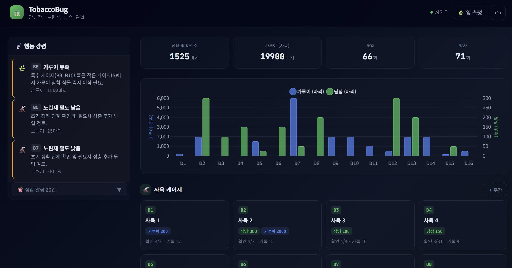

# TobaccoBug: 담배장님노린재 사육 관리 시스템

> 본전공(생물/농학)과 복수전공(컴퓨터공학)의 콜라보

---

## Visual Demonstration



---

## Motivation & Problem

담배장님노린재(*Nesidiocoris tenuis*)는 해충 방제에 탁월한 천적 곤충입니다.
그러나 포식자와 먹이(가루이)의 비율, 동족포식 위험, 케이지별 밀도를 정밀하게 관리해야만 성공적으로 사육할 수 있습니다.

기존 수기 기록 방식은 데이터 누락이 잦고 이상 상황을 실시간으로 파악하기 어려웠습니다.
이를 해결하기 위해 사육 데이터를 디지털화하고, 위험 상황을 즉각 감지할 수 있는 전용 관리 시스템을 개발했습니다.

---

## Tech Stack & Rationale

| 역할 | 기술 | 선택 이유 |
|------|------|-----------|
| Backend | Python + Flask | 빠르고 가벼운 REST API 서버 구축 |
| Database | SQLite | 별도 DB 서버 없이 로컬 파일 기반 저장 |
| Frontend | HTML/CSS + Vanilla JS (ES Modules) | 프레임워크 없이 모듈화된 상태 관리 |
| API 문서 | Swagger UI (flasgger) | API 테스트와 문서화를 동시에 |
| 기술 문서 | Sphinx + GitHub Actions | 코드에서 자동 생성, GitHub Pages에 배포 |

---

## Key Features

- **케이지 대시보드**: Big(사육), Small(가루이 증식), Petri(페트리 디쉬) 케이지 상태를 한눈에 모니터링
- **활동 로그 관리**: 개체 투입, 방사, 밀도 변화, 메모 기록 추가/삭제
- **행동 강령 알림**: 동족포식 위험·가루이 부족 등 사육에 치명적인 상황을 자동 감지·경고
- **Swagger UI**: 6개 REST API 엔드포인트를 인터랙티브하게 테스트

---

## Getting Started

### 로컬 실행

```bash
git clone https://github.com/steppenhj/TobaccoBug.git
cd TobaccoBug/tobaccobug
pip install flask flasgger
python app.py
```

브라우저에서 `http://localhost:5000` 으로 접속합니다.

### API 문서 (Swagger UI)

서버 실행 후 `http://localhost:5000/apidocs` 에 접속합니다.

### 기술 문서 (Sphinx)

`main` 브랜치에 push 하면 GitHub Actions가 자동으로 빌드·배포합니다.

👉 [TobaccoBug 기술 문서 보러가기](https://steppenhj.github.io/TobaccoBug/)

---

## Lessons Learned & Challenges

본전공 지식(생물/농학)에 컴퓨터공학을 접목하자 사육 관리의 효율이 눈에 띄게 향상됐습니다.
데이터 기록과 알림을 시스템화한 덕분에 동족포식 제어와 먹이 비율 유지에 성공하여, 담배장님노린재 사육을 완수할 수 있었습니다.

한편, 그 이상의 고도화—카메라를 이용한 개체 수 자동 카운팅(Computer Vision)이나 AI 기반 생육 예측—는 개인이 구현·유지하기 어려운 영역이었습니다.
전문성과 팀 단위 접근이 필요한 과제로, 현재 시스템의 명확한 한계로 남아 있습니다.
